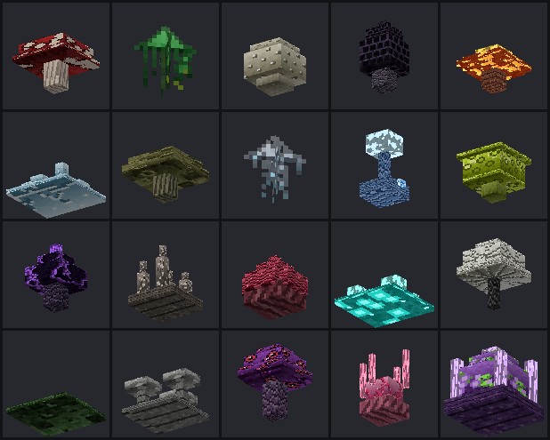

# Dangerous Fungi

A Minecraft **Bedrock Edition** add-on that adds **20 fictional dangerous fungus species**,
a **Fungal Scanner**, and a five-piece set of **hazard equipment**.

Built and tested against **Bedrock 1.21.0** (the build in the reference screenshot,
`1.21.0.26`, Android / Pocket Edition). Every block, item, particle, feature and script
API used is **stable at 1.21.0**, so **no experimental toggles are required**.

Download: **[`dist/Dangerous_Fungi.mcaddon`](dist/Dangerous_Fungi.mcaddon)**

---

## Installing on Android

1. Download **`Dangerous_Fungi.mcaddon`** onto the device.
2. Tap the file. Minecraft opens and imports both packs automatically.
3. Create or edit a world → **Behavior Packs** → activate **Dangerous Fungi BP**.
   The resource pack is pulled in as a dependency; if it is not, also activate
   **Dangerous Fungi RP** under **Resource Packs**.
4. Leave every experimental toggle **off** — none are needed.

When you spawn in with the pack active, chat shows:

```
[Dangerous Fungi] v1.0.0 loaded - 20 species active. /function fungi_help
```

If that line does not appear, the behaviour pack's scripts are not running and no fungus
will do anything. Turn on **Settings → Creator → Content Log GUI** to see why.

If tapping the file does not open Minecraft, rename it to `Dangerous_Fungi.zip` and copy
the two inner folders into:

```
Android/data/com.mojang.minecraftpe/files/games/com.mojang/behavior_packs/dangerous_fungi_bp
Android/data/com.mojang.minecraftpe/files/games/com.mojang/resource_packs/dangerous_fungi_rp
```

---

## Finding them in the Creative inventory

All 20 species are ordinary placeable blocks with their own identifier, model, texture and
name. Open the Creative inventory and either:

- browse the **Nature** tab — they are grouped together beside the vanilla mushrooms, or
- **search the species name**: typing `Bloodcap` finds *Bloodcap Fungus*, typing
  `Mycelium` finds *Mycelium-X Core*.

The Fungal Scanner is in the **Items** tab; the five armour pieces are in **Equipment**,
each beside its vanilla counterpart.

Fastest route for testing:

```
/function fungi_give_all
```

That hands over 8 of every species plus the scanner and the complete hazard set.

---

## The twenty species

Danger levels: **I** Irritant · **II** Harmful · **III** Toxic · **IV** Extremely Dangerous ·
**V** Catastrophic.

"Range" is how far the aura reaches. Damage is per second while you are inside it; contact
damage is added on top when you are standing in the block itself.

| # | Species | Identifier | Danger | Range | Damage | Effects | Habitat |
|---|---------|-----------|:------:|:-----:|--------|---------|---------|
| 1 | **Bloodcap Fungus** | `fungi:bloodcap` | III | 3 | 1/s +1 contact | Wither | Damp cave walls and abandoned mineshafts |
| 2 | **Toxic Veil** | `fungi:toxic_veil` | II | 3.5 | — | Poison | Swamp shallows and rotting wood |
| 3 | **Sporeburst Mushroom** | `fungi:sporeburst` | II | 3 | every 2s | Nausea, Blindness | Forest floors and leaf litter |
| 4 | **Shadow Morel** | `fungi:shadow_morel` | III | 3.5 | — | Blindness | Lightless caverns far from any torch |
| 5 | **Embercap** | `fungi:embercap` | IV | 3 | 2/s +2 contact | *ignites you* | Nether wastes and basalt fields |
| 6 | **Frost Mold** | `fungi:frost_mold` | II | 3.5 | — | Slowness II | Snowfields, ice sheets, frozen peaks |
| 7 | **Rotcap** | `fungi:rotcap` | II | 3 | — | Hunger, Weakness | Rotting logs in swamps and old forests |
| 8 | **Phantom Fungus** | `fungi:phantom_fungus` | III | 4 | — | Nausea, Blindness | Deep, still caves — rare |
| 9 | **Shockshroom** | `fungi:shockshroom` | IV | 3 | 3 every 3s | — | Ore-rich cave systems |
| 10 | **Acid Bloom** | `fungi:acid_bloom` | III | 2.5 | +3 contact | Poison II | Humid jungle basins and swamp edges |
| 11 | **Voidcap** | `fungi:voidcap` | IV | 3 | 2/s +2 contact | Darkness, Mining Fatigue | Deepest deepslate, near sculk (Deep Dark depths) |
| 12 | **Spine Fungus** | `fungi:spine_fungus` | III | 2 | +4 contact | *also hurts mobs* | Cave floors and ravine ledges |
| 13 | **Crimson Brain Fungus** | `fungi:crimson_brain` | III | 3 | +1 contact | Nausea, Weakness | Crimson forests and nether wastes |
| 14 | **Glowspore** | `fungi:glowspore` | II | 5 | — | Mining Fatigue · *contaminated area* | Lush cave pockets and flooded tunnels |
| 15 | **Deathbell Mushroom** | `fungi:deathbell` | IV | 4 | 1/s +2 contact | Poison II, Weakness, Slowness, Blindness | Deep caves and forgotten structures — very rare |
| 16 | **Creeping Mold** | `fungi:creeping_mold` | II | 3 | — | Weakness · *spreads* | Damp stone and swamp mud |
| 17 | **Ash Fungus** | `fungi:ash_fungus` | II | 3 | — | Weakness | Basalt deltas and burnt ground |
| 18 | **Nightmare Cap** | `fungi:nightmare_cap` | IV | 4 | 1/s +1 contact | Darkness, Slowness II, Nausea | Under dark oak canopy — rare |
| 19 | **Parasite Bloom** | `fungi:parasite_bloom` | IV | 4 | +1 contact | *fungal infection* | Jungle undergrowth and drowned roots — rare |
| 20 | **Mycelium-X Core** | `fungi:mycelium_x` | **V** | 6 | 2/s +3 contact | Poison II, Weakness II, Slowness II, Nausea, Darkness · *infection, contamination, spreads* | Only the deepest bedrock-adjacent voids — extremely rare |

Each species has its own 3D model (broad caps, spires, bells, crusts, spike clusters,
hanging veils, tendrils and a mutated core), its own cap and stem materials, its own
light level, and its own tinted spore particle. They are not recolours of one mushroom.



*Rendered from the shipped geometry and textures by `tools/render_preview.py`, in the
species order of the table above.*

### Two fictional statuses

- **Contamination** — Glowspore and Mycelium-X saturate a wide area. While you are in it
  the warning line reads `CONTAMINATED AREA`.
- **Infection** — Parasite Bloom and Mycelium-X seed a made-up fungal infection that keeps
  working for 60 seconds after you leave, pulsing Weakness and Nausea every 5 seconds.
  Cure it by drinking **milk**, or with `/function fungi_clear_effects`.

---

## Fungal Scanner

Hold the **Fungal Scanner** and use it (tap the use button on touch controls). It sweeps
6 blocks in every direction and prints a full readout to chat, plus a summary on the
action bar:

```
FUNGAL ANALYSIS -------------------
Species: Bloodcap Fungus
Danger:  LEVEL III - TOXIC
Range:   3 blocks (you are 2.2 away)
Status:  ACTIVE - you are inside the aura
Damp cave walls and abandoned mineshafts.
-------------------
```

It lists up to six nearby species, most dangerous first, and says `CLEAR` when nothing is
in range.

---

## Protective equipment

| Item | Slot | Armour | Effect on fungal auras |
|------|------|:------:|------------------------|
| **Spore Mask** | Head | 1 | −12% — blunts spore-borne effects only |
| **Hazard Helmet** | Head | 3 | −18% |
| **Hazard Chestplate** | Chest | 7 | −18% |
| **Hazard Leggings** | Legs | 5 | −14% |
| **Hazard Boots** | Feet | 3 | −14% |
| **Complete hazard set** | all four | 18 | **−65%** |

How the reduction works: it shortens effect durations, drops the amplifier by one on
strong protection, and scales damage. Effects that fall under 1 second and damage under
0.25 are dropped entirely — so a full suit *prevents* the weakest auras outright while
only *reducing* the strong ones.

Deliberate limits:

- A partial kit caps at −50%, so the complete set is always meaningfully better.
- Against **Mycelium-X Core (Level V)** protection is capped at **−40%** no matter what
  you wear. Nothing in this add-on makes the worst species safe.
- Contact damage from Spine Fungus and Acid Bloom still gets through the boots.

---

## Commands

| Command | What it does |
|---------|--------------|
| `/function fungi_help` | Command reference in chat |
| `/function fungi_give_all` | All 20 species, the scanner and the full hazard set |
| `/function fungi_danger_list` | Every species with its danger level and habitat |
| `/function fungi_test_area` | Builds the labelled testing field (see below) |
| `/function fungi_clear_effects` | Clears effects, contamination and infection |
| `/function fungi_spread_on` | Allows the two spreading species to grow |
| `/function fungi_spread_off` | Stops all spreading |
| `/function fungi_emergency_cleanup` | Deletes every fungus within 12 blocks and clears your status |
| `/function fungi_status` | Version, spreading state, nearby growth count, scan budget |

The spreading setting is stored on the world, so it survives a reload.

### Testing field

`/function fungi_test_area` flattens a 49×49 plot around you, floors it, and places all 20
species on colour-coded pedestals with **9 blocks of spacing**, each labelled with a sign
showing the species name and danger level:

| Pedestal | Danger |
|----------|--------|
| Emerald block | I |
| Gold block | II |
| Copper block | III |
| Redstone block | IV |
| Obsidian | V |

⚠️ It **replaces terrain** in that area — run it somewhere you do not mind flattening.

---

## Survival discovery

Every species also generates naturally, in different environments and at very different
rarities, using stable `single_block_feature` + `feature_rules` world generation:

- **Surface**: swamps (Toxic Veil, Acid Bloom, Creeping Mold), forests (Sporeburst,
  Rotcap), dark forest (Nightmare Cap), jungle (Acid Bloom, Parasite Bloom), snowy biomes
  (Frost Mold), the Nether (Embercap, Crimson Brain, Ash Fungus).
- **Underground**: ordinary caves (Bloodcap, Spine Fungus, Shockshroom, Glowspore),
  lightless depths (Shadow Morel, Phantom Fungus), and deepslate/Deep Dark depths of
  y −60 to −20 (Voidcap, Deathbell).
- **Mycelium-X Core** only generates below y −35, at a 1-in-40 scatter chance with a
  single iteration — by far the rarest thing in the pack.

Rarity is tuned per species; common irritants use a 1-in-4 or 1-in-5 chance with 2–3
iterations per chunk, while the Level IV and V species drop to 1-in-12 through 1-in-40
with a single iteration.

---

## Controlled spreading

Creeping Mold and Mycelium-X Core can spread. The system is built so that a fungal
outbreak **cannot** run away on a phone:

- **One attempt per 10 seconds for the entire world** — not per block, not per chunk.
- **At most one new block per attempt**, and only after a probability roll (25% for
  Creeping Mold, 18% for Mycelium-X).
- **Only growths near a player are considered**, so unloaded and unvisited chunks can
  never grow anything.
- **Density cap**: if there are already 6 (Creeping Mold) or 4 (Mycelium-X) of the same
  species within 2 blocks, the attempt is abandoned.
- The target must be **air with solid ground beneath it**, within 2 blocks of the source.

Worst case is one new fungus every ten seconds, right next to a player who can watch it
happen. `/function fungi_spread_off` stops even that, and
`/function fungi_emergency_cleanup` removes a patch outright.

---

## Mobile performance

The add-on is built for Android first.

- **The aura sweep is sliced.** A player's surroundings (754 positions within 6 blocks)
  are swept once per second, but spread across the 20 ticks of that second — about
  **38 block reads per player per tick**. Nothing scans every block every tick.
- **Effects are per species, not per block.** 81 Bloodcaps around you cost the same as
  one: only the nearest instance of each species acts.
- **Hard cosmetic budgets.** At most 6 particle emissions per second across the whole
  server, at most 2 entity queries, and effects are applied with `showParticles: false`.
- **No spawned entities.** The whole add-on uses zero entities and zero ticking areas.
- **No repeating command blocks or global commands.**
- **Cleanup is sliced too** — the emergency sweep processes 320 blocks per tick instead
  of stalling the frame.

Measured in the test harness: worst observed tick with 4 players was well inside budget,
and a 81-growth patch emitted ≤ 8 particles and ≤ 3 effect applications per second.

---

## Repository layout

```
behavior_packs/dangerous_fungi_bp/
  manifest.json              min_engine_version 1.21.0, script + data modules
  blocks/*.json              20 block definitions (format_version 1.21.0)
  items/*.json               scanner + 5 armour pieces
  features/*.json            20 single_block_feature definitions
  feature_rules/*.json       20 placement rules
  functions/*.mcfunction     9 commands
  scripts/main.js            aura, scanner, infection, spreading, cleanup
  scripts/fungi_data.js      GENERATED species table
resource_packs/dangerous_fungi_rp/
  manifest.json
  models/blocks/*.geo.json   20 block geometries
  particles/*.json           20 tinted spore effects
  attachables/*.json         5 worn-armour definitions
  textures/blocks/*.png      41 cap/stem/glow materials
  textures/items/*.png       6 icons
  textures/models/armor/     3 worn armour layers
  textures/terrain_texture.json, item_texture.json
  texts/en_US.lang           every block and item name
tools/
  fungi_spec.py              SINGLE SOURCE OF TRUTH - all 20 species
  fungi_shapes.py            block geometry definitions
  pixel.py                   stdlib PNG writer + drawing primitives
  gen_fungi_textures.py      draws every PNG
  gen_fungi_pack.py          writes every JSON/text file
  build_fungi.py             validates + packages the .mcaddon
  test_validator.py          proves the validator rejects broken packs
  sim_test.mjs               runtime simulation of main.js
  render_preview.py          rasterises the block models to a contact sheet
dist/Dangerous_Fungi.mcaddon
docs/preview_models.png
```

## Rebuilding

```bash
python3 tools/gen_fungi_textures.py    # redraw every PNG (--preview <key> for ASCII art)
python3 tools/gen_fungi_pack.py        # regenerate all pack JSON from the spec
python3 tools/build_fungi.py           # validate + write dist/Dangerous_Fungi.mcaddon
python3 tools/test_validator.py        # check the validator still rejects broken packs
node    tools/sim_test.mjs             # run the behaviour script against a stubbed API
python3 tools/render_preview.py        # redraw docs/preview_models.png from the geometry
```

### What the validator refuses to ship

`build_fungi.py` fails the build on malformed JSON, a bad or duplicate UUID, a missing
BP → RP dependency, an RP that depends on a BP, a missing script entry, a block whose
identifier does not match its filename, **a block with no `menu_category` (which would
keep it out of the Creative inventory)**, a geometry that has no model, a material
instance whose texture is missing from `terrain_texture.json` or missing on disk, a
per-face material name the block never declares, a selection box outside the legal
envelope, an invalid render method, an out-of-range light value, an item icon using the
deprecated flat `texture` field, a wearable with no attachable, an engine-namespaced tag,
a feature or rule whose identifier does not match its filename, a rule pointing at a
missing feature, an unknown placement pass, a `give` command naming an item that does not
exist, a `scriptevent` main.js does not handle, a missing display name in `en_US.lang`,
two species sharing a name, a JavaScript syntax error, and a finished archive whose
top-level folders or block count are wrong.

`test_validator.py` keeps that honest: it corrupts one thing at a time — 29 mutations,
each restored afterwards — and asserts the build rejects every one with a message naming
the real problem. All 29 are currently caught.

`sim_test.mjs` then executes `main.js` against a strict stub of `@minecraft/server` — 43
assertions covering aura application, range limits, protection maths, the Level V cap, all
20 species, the per-tick block budget, particle budgets, the scanner readout, disturbance
on break, spreading limits and the off switch, the testing field, emergency cleanup, the
infection cure and unloaded-chunk safety.

## Tuning

Almost everything is data. Species stats, effects, colours, rarity and habitats live in
`tools/fungi_spec.py`; geometry lives in `tools/fungi_shapes.py`. Change either and re-run
the three build commands. Runtime numbers that are not per species — scan radius, cosmetic
budgets, protection percentages, infection duration, spread rate — sit in the `CONFIG`
object at the top of `behavior_packs/dangerous_fungi_bp/scripts/main.js`.

## Compatibility notes

- **Version floor:** `min_engine_version` is `1.21.0`; the script module is
  `@minecraft/server 1.11.0`, the stable line for that release. Do not bump the module
  version — a higher one will not resolve on 1.21.0.26.
- **No experiments.** Data-driven blocks, `menu_category`, `material_instances`,
  per-face `material_instance`, `single_block_feature`/`feature_rules`, custom particles,
  attachables and the stable script API are all shipped features at 1.21.0.
- **Icon syntax:** `minecraft:icon` must use `{"textures": {"default": "<key>"}}` at
  format_version 1.20.60+. The old flat `texture` field is silently ignored and renders a
  blank icon; the validator rejects it.
- **Material names:** cap faces name no material instance at all and fall through to the
  block's `"*"`. Naming an instance the block does not declare leaves the face unskinned.
- **Defensive scripting:** every particle, sound and cosmetic call is individually
  wrapped, event handlers are guarded, the block-break event binds to whichever of
  `playerBreakBlock` / `blockBreak` the build exposes, and unloaded chunks are caught per
  block read rather than aborting the sweep.
- **Creative mode** players take no damage (vanilla behaviour), but effects and the
  warning line still apply, so the add-on is easy to demonstrate safely.
