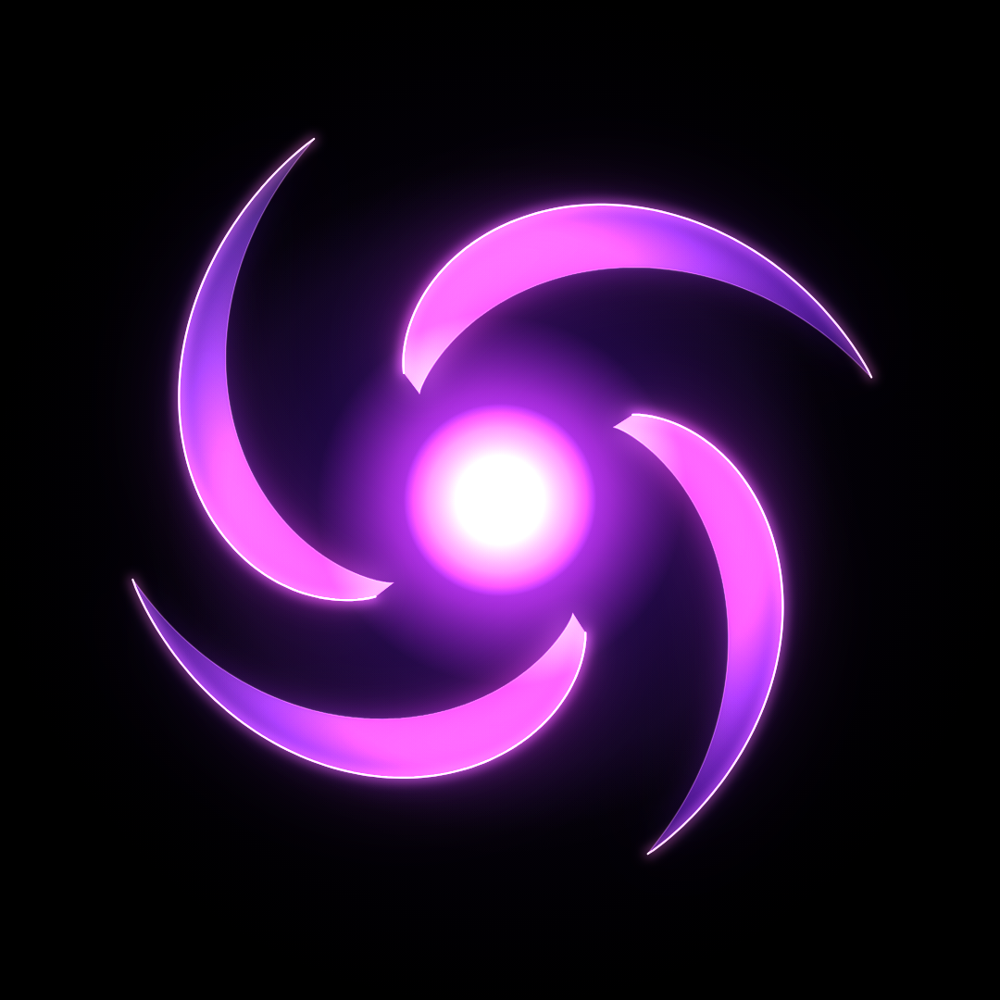

# AI Energy Orb — animated logo

A premium AI assistant thinking/loading animation: a breathing purple/magenta
energy core with four glossy liquid-energy blades orbiting around it, on pure
black. Rendered as a perfect seamless 6-second loop.

**Final video:** [`ai-energy-orb.mp4`](./ai-energy-orb.mp4) — 1080×1080, 60 fps,
H.264 (yuv420p), 6.00 s seamless loop, ~2 MB.



## Animation design

- The bright core stays fixed in the center and "breathes": glow expands and
  brightens, then softly contracts (3 slow cycles per loop plus a faint upper
  harmonic so it never feels metronomic).
- Four curved blades orbit continuously with smooth acceleration/deceleration
  (two ease swells per loop). While they run fast, extremely subtle blurred
  energy trails follow them.
- Each blade independently bends, stretches and contracts like liquid energy —
  every blade has its own phases and harmonics, so the four never move in
  lockstep.
- Twice per loop a soft wave of light travels from the core outward through the
  blades (masked to the blade shapes, with a brief core flash as it launches).
- Glossy look: glassy radial gradient bodies, a sharp bright rim along each
  leading edge, a fixed world-space sheen the blades catch as they sweep the
  upper left, and layered gaussian bloom for volumetric glow.

## Seamless loop

Every animated quantity in `orb.html` is a sum of integer-harmonic sinusoids of
`u = t / T`, and the net rotation per loop is exactly 2π — so frame N wraps
bit-exactly onto frame 0. No visible restart.

## Regenerating

```sh
npm install                  # playwright-core (uses the preinstalled Chromium)
npm run render               # 360 PNG frames → frames/
ffmpeg -framerate 60 -i frames/f%04d.png -c:v libx264 -pix_fmt yuv420p \
       -crf 17 -preset slow -movflags +faststart ai-energy-orb.mp4
```

`orb.html` also plays the animation live if you simply open it in a browser.
Tweak look/timing via the constants at the top of its script (loop length,
rotation swell, per-blade harmonics, colors, wave timing).
